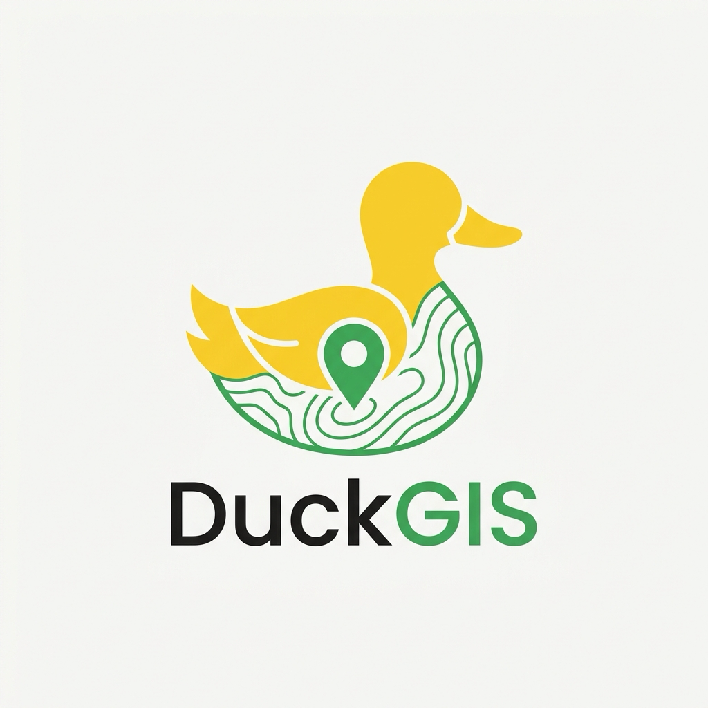

<p align="center">
  
</p>

<h1 align="center">DuckGIS</h1>

<p align="center">
  <b>High-Performance DuckDB Spatial Studio & Cloud GeoParquet Engine for QGIS</b>
</p>

<p align="center">
  <a href="https://qgis.org"></a>
  <a href="https://duckdb.org"></a>
  <a href="https://github.com/Barbhuiya12/DuckGIS/blob/main/LICENSE"></a>
  <a href="https://python.org"></a>
  <a href="https://github.com/Barbhuiya12/DuckGIS/stargazers"></a>
</p>

---

## ⚡ What is DuckGIS?

**DuckGIS** brings the lightning speed of **DuckDB** and **DuckDB Spatial** directly into QGIS. 

Query millions of spatial records, stream massive cloud datasets (**Overture Maps**, **Source Cooperative**, **Microsoft Building Footprints**) over HTTP/S3 without downloading gigabytes of files, and load the results onto your QGIS map canvas in milliseconds.

```sql
-- Stream Overture Maps buildings in your current QGIS view in ~200ms
SELECT 
    id, names.primary AS name, height, ST_GeomFromWkb(geometry) AS geom
FROM read_parquet('s3://overturemaps-us-west-2/release/2024-02-15-alpha.0/theme=buildings/type=building/*')
WHERE 
    bbox.xmin <= {{BBOX_XMAX}} AND bbox.xmax >= {{BBOX_XMIN}}
    AND bbox.ymin <= {{BBOX_YMAX}} AND bbox.ymax >= {{BBOX_YMIN}}
LIMIT 5000;
```

---

## ✨ Key Features

- 🚀 **Blazing Fast Spatial SQL**: Powered by vectorized C++ DuckDB engine and DuckDB Spatial extension.
- ☁️ **Direct Cloud GeoParquet Streaming**: Query remote datasets hosted on AWS S3, HuggingFace, Cloudflare R2, or HTTP without downloading the full archive.
- 📍 **Interactive `{{BBOX}}` Canvas Sync**: Inject your active QGIS map bounding box with one click to spatially partition remote queries automatically.
- 🗺️ **One-Click "Add to Map Canvas"**: Converts SQL query results directly into native QGIS vector layers (memory layers or fast GeoPackage).
- 📥 **Query Existing QGIS Layers**: Expose your active shapefiles, geopackages, or scratch layers as virtual DuckDB tables to perform spatial joins in pure SQL.
- 💡 **Built-in Spatial Snippet Library**: Pre-loaded queries for Overture Maps, remote GeoParquet, CSV lat/lon conversion, convex hulls, and spatial aggregations.
- 🛠️ **1-Click Dependency Installer**: Self-healing setup checks for `duckdb` inside QGIS's Python environment and installs it with a single click.

---

## 📊 Performance Comparison

| Operation | Traditional QGIS | DuckGIS (DuckDB Spatial) | Speedup |
|---|---|---|---|
| Query 5M Row Remote Parquet | ❌ Crash / 15+ mins | ⚡ **1.2 seconds** | **~750x faster** |
| Bounding Box Filter on S3 | 📥 Full Download Required | ⚡ **350 ms** (HTTP Range Request) | **Instant** |
| Spatial Join (100k x 10k points) | ⏳ 45 seconds | ⚡ **1.8 seconds** | **25x faster** |

---

## 🚀 Quickstart & Installation

### Option 1: Install via ZIP (Recommended)
1. Download the latest `DuckGIS.zip` from the [Releases](https://github.com/Barbhuiya12/DuckGIS/releases) page.
2. In QGIS, navigate to **Plugins** -> **Manage and Install Plugins...** -> **Install from ZIP**.
3. Select `DuckGIS.zip` and click **Install Plugin**.
4. Click the **DuckGIS** icon in your toolbar or open via **Database** -> **DuckGIS Studio**.

### Option 2: Clone into QGIS Plugins Directory

**macOS:**
```bash
cd ~/Library/Application\ Support/QGIS/QGIS3/profiles/default/python/plugins/
git clone https://github.com/Barbhuiya12/DuckGIS.git
```

**Linux:**
```bash
cd ~/.local/share/QGIS/QGIS3/profiles/default/python/plugins/
git clone https://github.com/Barbhuiya12/DuckGIS.git
```

**Windows (PowerShell):**
```powershell
cd "$env:APPDATA\QGIS\QGIS3\profiles\default\python\plugins\"
git clone https://github.com/Barbhuiya12/DuckGIS.git
```

---

## 📖 Example Workflows

### 1. Stream Overture Maps Buildings into QGIS
1. Zoom to your area of interest in QGIS.
2. Open DuckGIS and select the preset: **"Overture Maps — Buildings in Current Map View"**.
3. Click **📍 Map BBox** to automatically insert your canvas coordinates.
4. Click **▶ Run (Ctrl+Enter)**.
5. Click **🗺️ Add to Canvas** — your buildings appear instantly on the map!

### 2. Spatial Join Active Layer with Remote Data
```sql
-- Join your active QGIS layer ('my_parcels') with an external GeoParquet dataset
SELECT 
    p.id,
    p.owner_name,
    COUNT(b.geom) as total_structures
FROM my_parcels p
JOIN read_parquet('s3://my-bucket/buildings.parquet') b
  ON ST_Intersects(p.geom, ST_GeomFromWkb(b.geometry))
GROUP BY p.id, p.owner_name;
```

---

## 🏗️ Architecture

```
DuckGIS
├── metadata.txt              # QGIS plugin manifest
├── duckgis_plugin.py         # QGIS GUI & action lifecycle manager
├── duckdb_engine.py          # DuckDB connector & spatial extension loader
├── layer_bridge.py           # 2-way conversion: DuckDB Results <-> QGIS Vector Layers
├── ui/
│   ├── dock_widget.py        # Dockable Spatial Studio UI
│   ├── sql_highlighter.py    # Syntax highlighting for SQL & ST_* spatial functions
│   ├── dependency_dialog.py  # 1-click Python package installer
│   └── styles.py             # Theme & UI design tokens
└── presets/
    └── query_library.json    # Curated spatial SQL snippets
```

---

## 🤝 Contributing & Roadmap

Contributions, suggestions, and PRs are warmly welcome!
- [ ] Arrow memory zero-copy sharing between DuckDB and QGIS
- [ ] Direct export to Cloud-Optimized GeoTIFF (COG)
- [ ] Auto-completion for DuckDB spatial SQL functions

Please open an [Issue](https://github.com/Barbhuiya12/DuckGIS/issues) to discuss feature requests or report bugs.


---

## 📄 License

DuckGIS is open-source software licensed under the [GNU General Public License v2.0 (GPL-2.0)](LICENSE).
